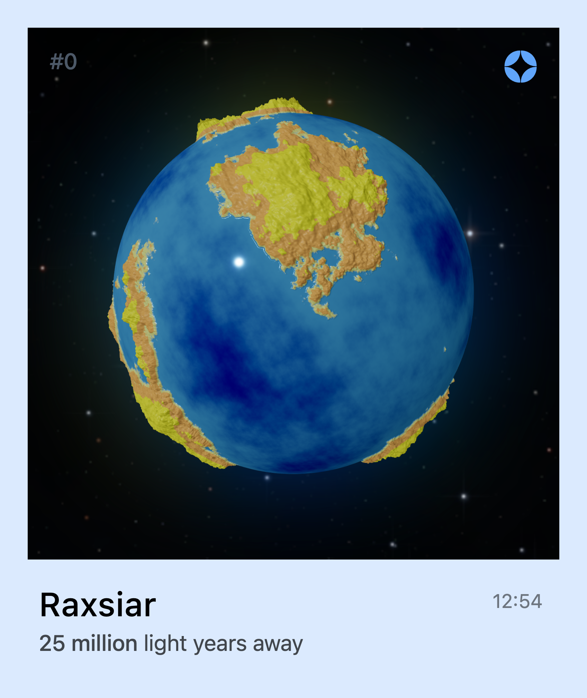
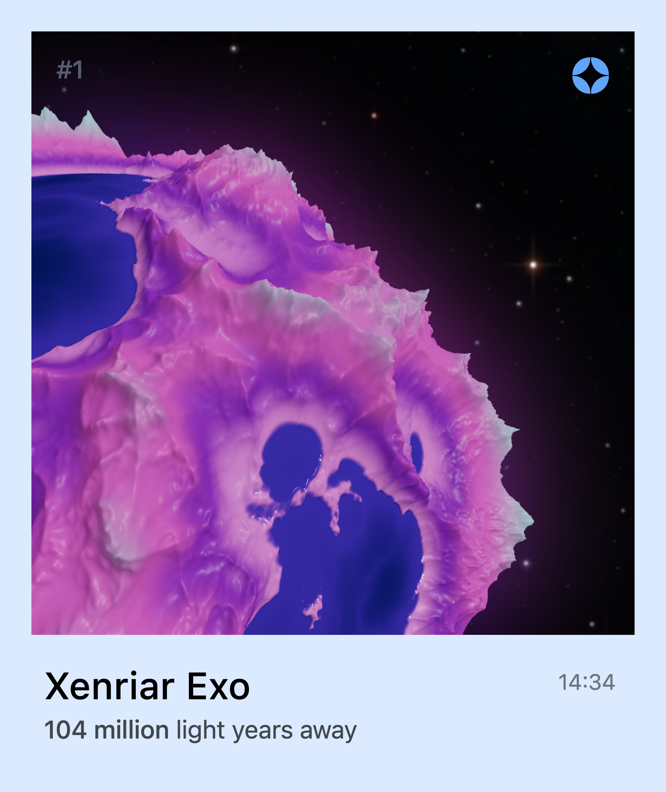
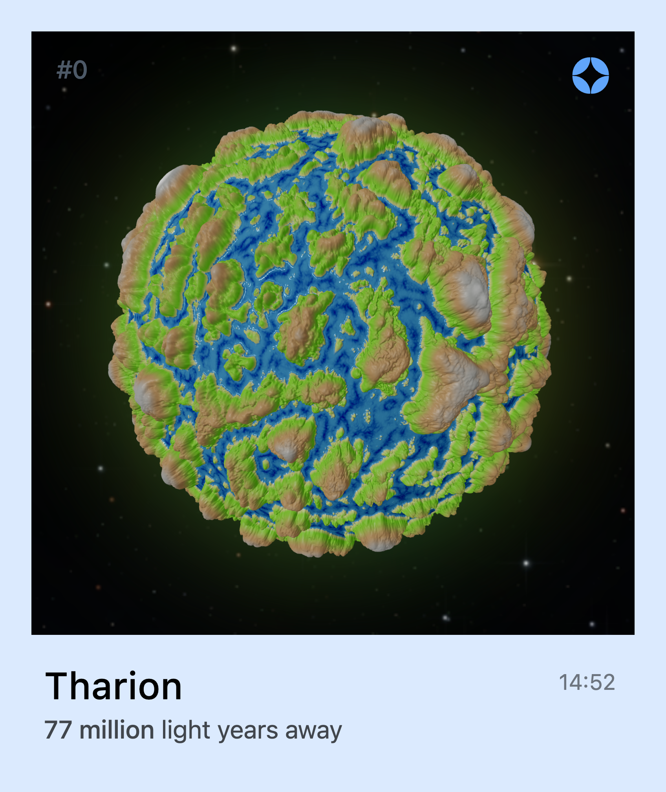

# Procedural Planet Generation (GPGPU)

<header style="display: flex; justify-content: center; width: 100%; gap: 12px; margin-bottom: 16px;">
  
  
  
</header>

This is a procedural planet mesh generation tool working on web technologies. Using multilayered simplex noises, we can simulate continents and mountains. In the showcase, a polaroid of the scene and the `.obj` file can be exported. Thanks _Sebastian Lague_ for it's series on the subject and the inspiration.

## Installation

## Technicality & Implementation
