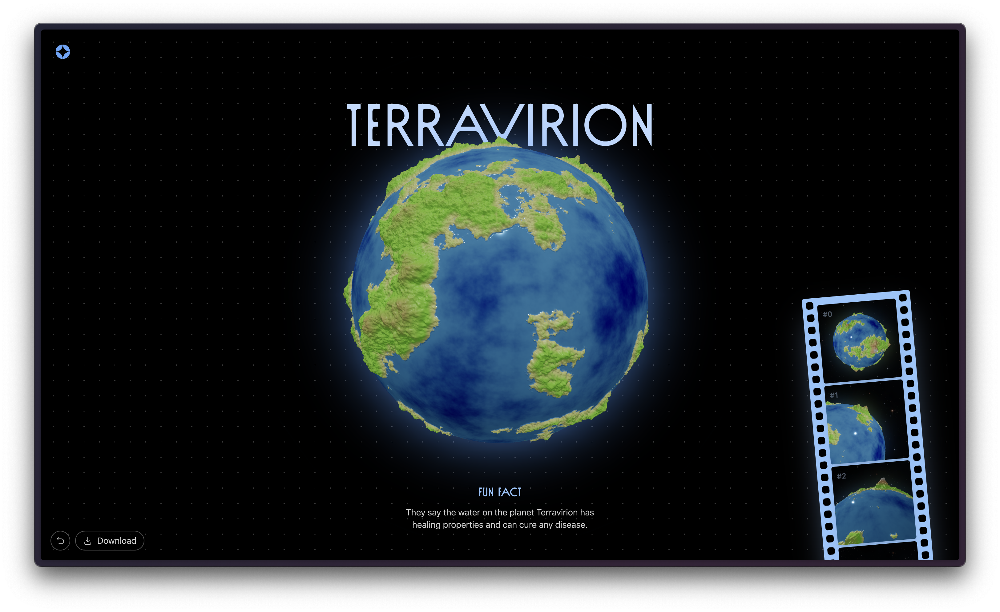
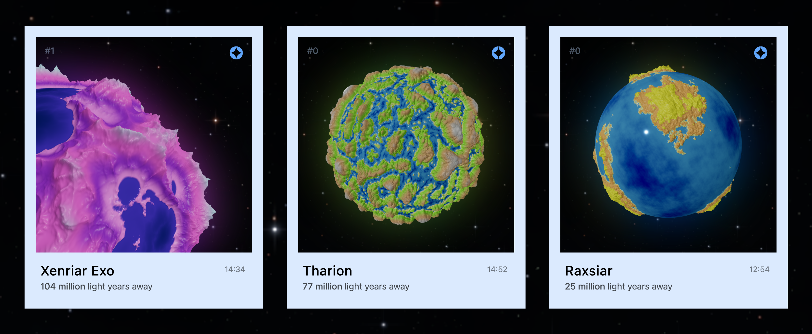

# Procedural Planet Generation (GPGPU)

This is a procedural planet mesh generation tool working on web technologies. Using multilayered simplex noises, we can simulate continents and mountains. In the showcase, a polaroid of the scene and the `.obj` file can be exported. Thanks to _Sebastian Lague_ for it's series on the subject and the inspiration.

## Installation

Since this is a web app, apparently, you need [NodeJS](https://nodejs.org/en) installed.

- `npm install`: Installs the necessary dependencies.
- `npm run dev`: Runs the local development server on [localhost:5173](http://localhost:5173).
- `npm run build`: Build the project as a client only bundle.

To utilize GPGPU, you don't need any additional configuration. Instead of WebGPU, it uses rendering pipeline, so it is widely supported. In case you need CPU generation, you can swap `PlanetGPU` with the `PlanetCPU` on the `src/editor/renderer.tsx`.

## Technicality & Implementation

## Generation Parameters

## Examples

